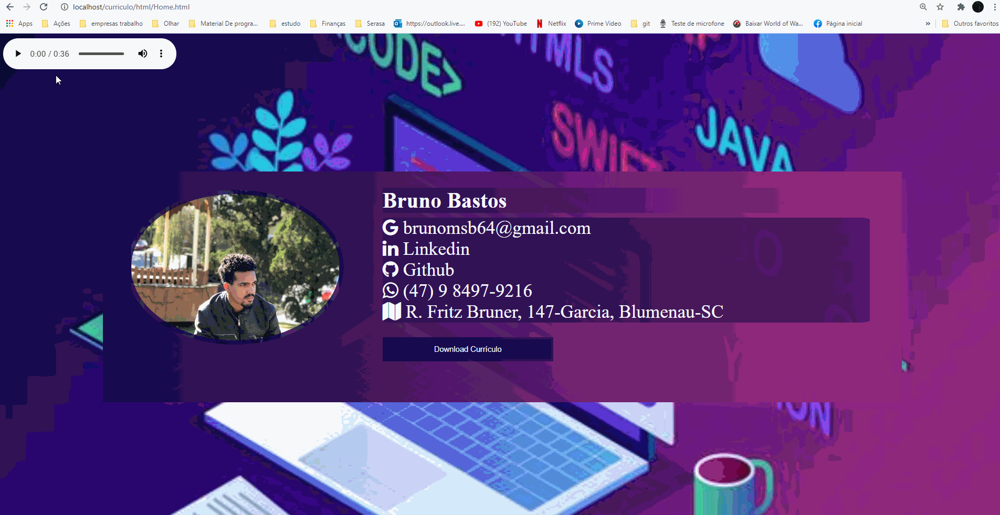

# Curriculo

##  Sobre o Projeto

Esta aplicação foi feita com o intuito de servi como apresentação de currículo, nala se pode encontrar meu email, linkdin e outros meios de contato.Também contem meu currículo para download e um audio me apresentando.

### 🛠 Ferramentas Utilizadas

- [HTML](https://html.com/)
- [CSS](https://pt.wikipedia.org/wiki/Cascading_Style_Sheets)
- [cloudflare](https://www.cloudflare.com/apps/social-icons)

### 🤔 Como Abrir a Página

- Faça o clone da pasta [Curriculo](https://github.com/BrunoBastos97/Curriculo) no github.
- Abra o arquivo Home.html

### 👨‍🏫 Layout da Tela

        

